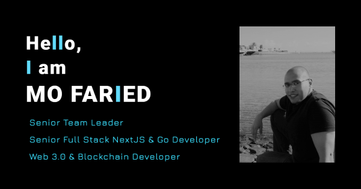

### Hi there 👋
I am Blockchain, Web3, Meta Certified React Frontend developer, and Node.js Backend developer with more than 13 years of experience in the software development field. I had led and worked with diverse teams who were located around the globe which was possible by working for multinational organizations for my entire career.

 ⚡ To view React & Full Stack Applications, please check my online portfolio: https://m-faried.github.io/m-faried-portfolio

 

    

 

## ✒️ Publications

 

✒️ [SMIS Design Pattern](https://medium.com/@m.a.faried/smis-design-pattern-d725a7ad814c)

✒️ [The Other Way To Handling Redux Async Operations](https://medium.com/@m.a.faried/the-otherway-to-handling-redux-async-operations-24ab95935a80)

✒️ [Building An Accurate Timer With React Hooks](https://medium.com/@m.a.faried/building-a-real-time-react-hook-99636cbbff72)

✒️ [Custom Gitflow Design Guidelines](https://www.linkedin.com/pulse/custom-git-workflow-design-guidelines-mohamed-faried)

✒️ [SCRUM In The Times Of COVID-19](https://www.linkedin.com/pulse/scrum-times-covid-19-mohamed-faried)

✒️ [Performance And Trust](https://www.linkedin.com/pulse/performance-trust-mohamed-faried)

✒️ [There Are 2 Approaches](https://www.linkedin.com/pulse/two-approaches-mohamed-faried)

✒️ [UNAGI Process, Not Another Agile Framework!](https://www.linkedin.com/pulse/unagi-process-another-agile-framework-mohamed-faried)

✒️ [C#-Like Events For Java](https://www.codeproject.com/Tips/1008821/Csharp-Like-Events-For-Java)

 

## 📜 Certificates

 

📜 [Meta Frontend Professional Certificate](https://www.coursera.org/account/accomplishments/professional-cert/FNLNN2VJ55SP)

📜 [Udacity Blockchain Developer Nanodegree](https://graduation.udacity.com/confirm/VLNMDKSV)

📜 [Blockchain Specialization At Buffalo University](https://www.coursera.org/account/accomplishments/specialization/TZJTAZVQQ3S6?utm_source=link&utm_medium=certificate&utm_content=cert_image&utm_campaign=pdf_header_button&utm_product=s12n)

📜 [Fintech: Foundations & Applications of Financial Technology](https://www.coursera.org/account/accomplishments/specialization/9B6R7CF2R79D?utm_source=link&utm_medium=certificate&utm_content=cert_image&utm_campaign=sharing_cta&utm_product=s12n)

📜 [Responsive Web Design Essentials - HTML5 CSS3 Bootstrap](https://www.udemy.com/certificate/UC-ac90844c-5ab0-46ae-b4e3-2d723a5684c3/)

📜 [React, Front To Back](https://www.udemy.com/certificate/UC-c4741f08-5a12-4c4b-a5ff-759068a26cc1/)

📜 [20 Web Projects With Vanilla JavaScript](https://www.udemy.com/certificate/UC-5c4733b8-2700-42a1-8244-2c95a402fc18/https://www.udemy.com/certificate/UC-5c4733b8-2700-42a1-8244-2c95a402fc18/)

📜 [Deep Learning Specialization](https://www.coursera.org/account/accomplishments/specialization/7H4CJFF5W5CK)

📜 [DeepLearning.AI TensorFlow Developer](https://www.coursera.org/account/accomplishments/specialization/T37HSDC3G34X)

 

## 📐 Web3 & Blockchain Repos

 

📐 [Real Estate Market Place](https://github.com/M-Faried/ubc-web3-real-estate-marketplace)

📐 [Supply Chain Dapp](https://github.com/M-Faried/ubc-web3-supply-chain-dapp)

📐 [Star Notary System](https://github.com/M-Faried/ubc-web3-erc721-star-notary-v3)

📐 [Flight Insurance Purchase Dapp](https://github.com/M-Faried/ubc-web3-flight-surety)

<!--
**M-Faried/M-Faried** is a ✨ _special_ ✨ repository because its `README.md` (this file) appears on your GitHub profile.

Here are some ideas to get you started:

- 🔭 I’m currently working on ...
- 🌱 I’m currently learning ...
- 👯 I’m looking to collaborate on ...
- 🤔 I’m looking for help with ...
- 💬 Ask me about ...
- 📫 How to reach me: ...
- 😄 Pronouns: ...
- ⚡ Fun fact: ...
-->
