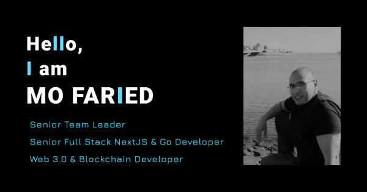

### Hi there 👋

Senior Software Engineer with 16 years of experience across embedded systems, backend development, blockchain, and distributed systems. I bring production depth in Go and Java microservices, a foundation in embedded C from a decade at Valeo, and am actively transitioning into Rust engineering — combining systems-level intuition with modern backend architecture experience.

 

<!-- 

    

 -->

 

## 🔗 Links

- [LinkedIn](https://www.linkedin.com/in/mo-faried-0258a445/)
- [Medium](https://medium.com/@m.a.faried)
- [Portfolio](https://m-faried.github.io/m-faried-portfolio/)

 

## 💻 Tech Stack

- Rust
- Go
- Solidity
- Ethereum Smart Contracts
- React & NextJS
- ExpressJS

 

##  Rust Repos

- [Space Invaders Game](https://github.com/M-Faried/Invaders)

##  Web3 & Blockchain Repos

- [English Auction Smart Contract And Go Service](https://github.com/M-Faried/english-auction-smart-contract)
- [Real Estate Market Place](https://github.com/M-Faried/ubc-web3-real-estate-marketplace)
- [Supply Chain Dapp](https://github.com/M-Faried/ubc-web3-supply-chain-dapp)
- [Star Notary System](https://github.com/M-Faried/ubc-web3-erc721-star-notary-v3)
- [Flight Insurance Purchase Dapp](https://github.com/M-Faried/ubc-web3-flight-surety)

##  Go Repos

- [Streaming Pipeline In Go](https://github.com/M-Faried/pipelines)
- [MPC Design Pattern Implementation In Go](https://github.com/M-Faried/mpc-implementation-in-go)

 

## 📝 Publications

- [Limits Of Software Abstraction](https://medium.com/@m.a.faried/limits-of-software-abstraction-c68cc69e6294)
- [MPC Design Pattern Proposal In Go](https://medium.com/@m.a.faried/mvc-or-mpc-e907f39f9e35)
- [SMIS Design Pattern Proposal](https://medium.com/@m.a.faried/smis-design-pattern-d725a7ad814c)
- [SMIS Design Pattern In Action](https://medium.com/@m.a.faried/smis-design-pattern-in-action-9a3c6daa85ae)
- [SMIS Vs Presentational & Container Component Design Patterns](https://medium.com/@m.a.faried/smis-vs-presentational-container-component-design-patterns-40efe64114e7)
- [Building An Accurate Timer With React Hooks](https://medium.com/@m.a.faried/building-a-real-time-react-hook-99636cbbff72)
- [The Other Way To Handling Redux Async Operations](https://medium.com/@m.a.faried/the-otherway-to-handling-redux-async-operations-24ab95935a80)
- [Custom Gitflow Design Guidelines](https://www.linkedin.com/pulse/custom-git-workflow-design-guidelines-mohamed-faried)

 

<!--
**M-Faried/M-Faried** is a ✨ _special_ ✨ repository because its `README.md` (this file) appears on your GitHub profile.

Here are some ideas to get you started:

- 🔭 I’m currently working on ...
- 🌱 I’m currently learning ...
- 👯 I’m looking to collaborate on ...
- 🤔 I’m looking for help with ...
- 💬 Ask me about ...
- 📫 How to reach me: ...
- 😄 Pronouns: ...
- ⚡ Fun fact: ...
-->
